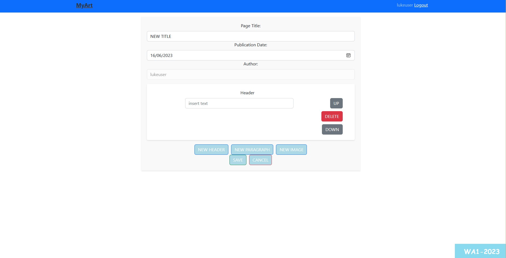
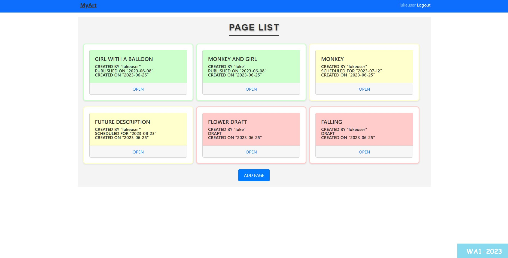

# Exam #12345: "CmsSmall"

## Student: s310524 de Candia Luca 

# Server side

## API Server
### PUBLIC APIs 

- POST `/api/login`
  - body with username and password in JSON format
  - user logged

- POST `/api/logout`
  - req is empty
  - acknowledgement

- GET `/api/PublishedPages`
  - req is empty
  - list of all published pages

- GET `/api/PublishedPages/:pageId/blocks`
  - page id of the requested blocks in req.params and no info in the body 
  - all blocks that match that pageId

- GET `/api/getAllUsers`
  -  body is empty 
  -  list of all users

- GET `/api/brand/get`
  - no information in the body
  - title of the CMS

  ### PRIVATE APIs 

- GET `/api/pages`
  -  body is empty 
  -  list of all pages in the DB 

- GET `/api/pages/:pageId/blocks`
  -  page Id of the page
  -  all blocks that match that pageId but published 

- POST `/api/blocks/update`
  - list of blocks to be updated
  - response on how it went 

- POST `/api/blocks/add`
  - list of blocks to be added
  - response on how it went 

- POST `/api/blocks/delete`
  - list of blocks to be deleted
  - response on how it went 

- POST `/api/page/delete`
  - id of the page to be deleted
  - response on how it went 

- POST `/api/page/add`
  - fields to create the new page obj
  - pageId of the page created

- POST `/api/page/:pageId/update`
  - id of the page to modify and the fields to modify 
  - response on how it went

- POST `/api/brand/update`
  - new name of the brand
  - response on how it went

- ...

## Database Tables

- Table `blocks` - contains blockId,content,position, pageId, type
  -constraints on pageId (foreign key)
  -contains all the blocks
- Table `users` - contains userId, type, username, password, name, surname, salt
  -contains all the users 
- Table `pages` - contains pageId, title, author, userId, creationDate, publicationDate
  - constraints on userid (foreign key)
  - contains all the pages
- Table `brandname` - contains brandId, brand 
  - contains brand name
- ...

# Client side

## React Client Application Routes

- Route `index`: recieves the list of all pages to pass as props and is the main page, where we can see the pages, login, logout, add a page
- Route `/login`: allows the login of the user
- Route `/blocks/:pageId`: possible to see all the blocks of a given page and gets a parameter which is the pageId of the page we want to see
- Route `/editPage/:pageId`: allows to edit the specific page, the parameter is the page id of the page we want to modify
- Route `/addPage`:  the page allows the creation of a new page
 
- ...

## Main React Components

- `Layout` (in `App.jsx`): contains the immutable elements of the page
- `PageList` (in `PageList.jsx`): shows the available pages based on user logged or not
- `LoginForm` (in `LoginForm.jsx`): form for the login 
- `BlockList` (in `BlockList.jsx`): shows all the blocks of a given page
- `NewOrEditPages` (in `NewOrEditPages.jsx`): handles the creation or the updating of a page

- ...

(only _main_ components, minor ones may be skipped)

# Usage info

the page does not need a login for the visualization of the published pages.
if the user is logged in he can , by interacting with the front end,  create a page, edit or delete the ones belonging to him.
if a user is an admin he can create, delete or update any page and the brand name. 

## Example Screenshot

## Users Credentials

- luke, password 
- lukeuser, password 
- lucanothing, password 
- professor, password 